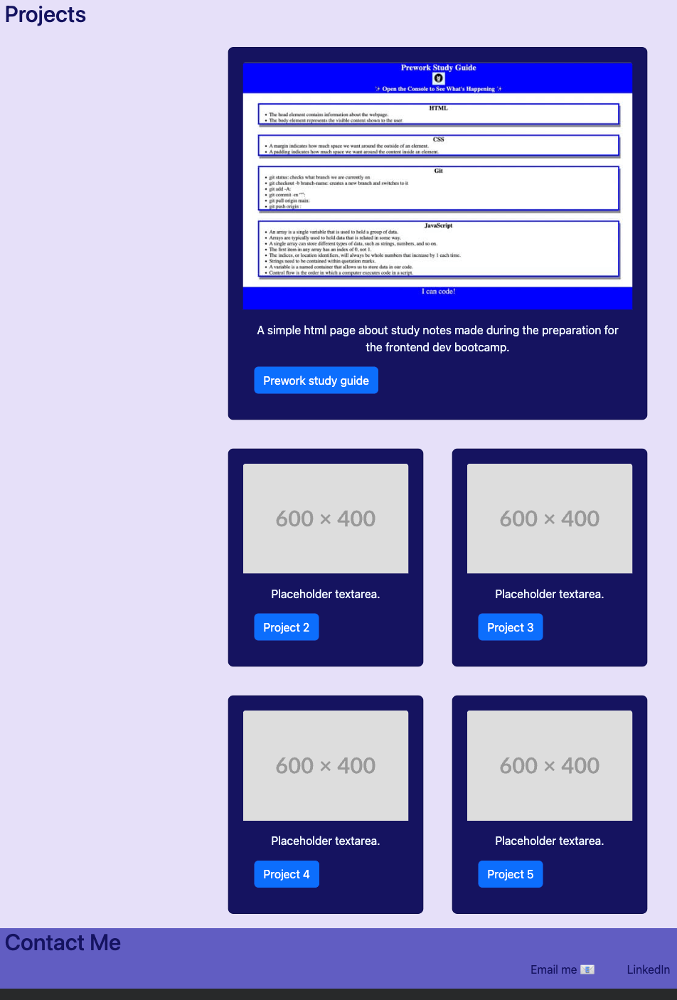

# Bootstrap-Portfolio

## Description

In this week's challenge :star_struck:, we were given the task to create a live (deployed) portfolio page containing projects we've worked on and space for future projects to be added, using Bootstrap.

Below is a screenshot of the website.
 
 

## Usage

This portfolio project's purpose is to display some of my skills as a developer, in a way that is visually pleasing and easier for clients and visitors to navigate around.

.png>)

In order to navigate this website, use the navigation bar shown in the screenshot above.

## Credits

Some of the tutorials used:

- https://getbootstrap.com/docs/5.3/examples/jumbotron/
- https://getbootstrap.com/docs/5.3/components/card/
- https://getbootstrap.com/docs/5.3/layout/grid/

## License

Licensed under the MIT license.
